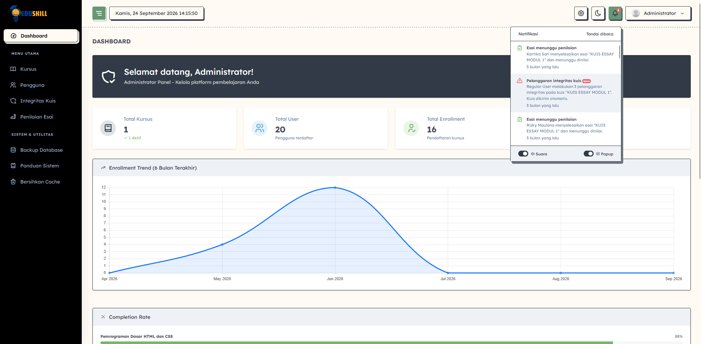
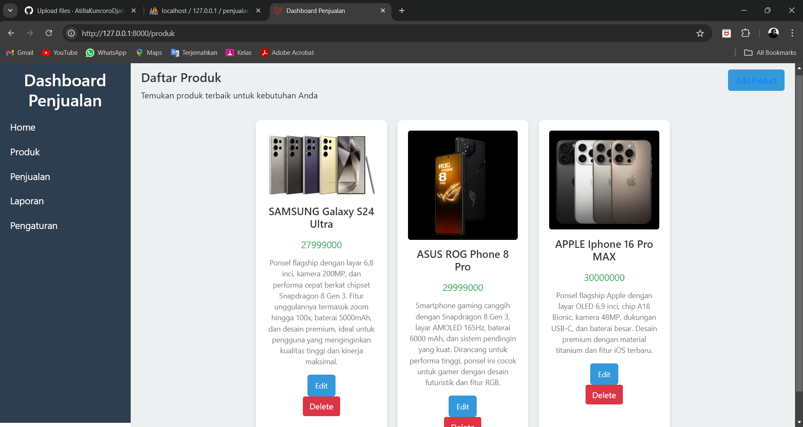
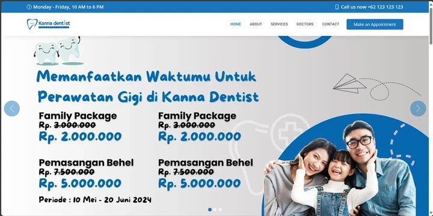
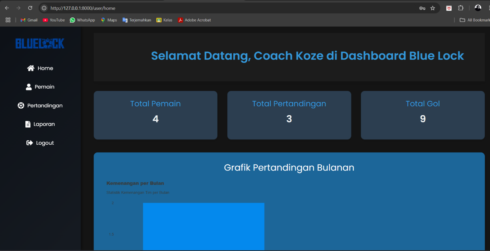

# Atilla — Portfolio

Portofolio pribadi Atilla Kuncoro Djati, dengan Bening Studio sebagai proyek unggulan dan daftar karya publik yang diambil dari GitHub. Tampilan merah, hitam, dan putih mengambil inspirasi dari bahasa visual Persona 5: tipografi tebal, komposisi poster, bentuk miring, serta tekstur komik.

**Website:** [atillakuncorodjati.vercel.app](https://atillakuncorodjati.vercel.app)

## Isi website

- Profil, foto, pendidikan, pengalaman magang, dan kontak berdasarkan CV Atilla.
- Foto pada halaman pembuka berupa kartu yang dapat dibalik. Pilihan Web/UI/UX/Data memperkenalkan fokus dan mengarahkan ke karya atau pengalaman terkait.
- Pilihan bahasa Indonesia/Inggris dan tema gelap/terang tersimpan pada perangkat pengunjung.
- Animasi masuk saat menggulir, kartu foto bergerak, pita teks berjalan, logo teknologi saat disorot, dan indikator progres membaca. Animasi mengikuti pengaturan pengurangan gerakan pada perangkat tanpa tombol tambahan di halaman.
- Layar pembuka bergaya poster dengan tagline “WELCOME TO MY WORLD”, nama Atilla, dan progres 0–100% saat halaman pertama kali dimuat.
- Gambar pratinjau tautan berukuran 1200 × 630 piksel, dengan judul dan deskripsi untuk Discord serta platform yang membaca Open Graph atau Twitter Cards.
- Bening Studio dengan pratinjau antarmuka serta tautan rilis terbaru.
- Daftar proyek web, desktop, dan data dari repositori publik.
- Filter kategori dan pencarian berdasarkan nama, deskripsi, serta teknologi.
- Detail proyek berisi tujuan, fitur, teknologi, dan tautan dokumentasi. Tautan seperti `/#proyek/Bening-Studio` dapat dibagikan langsung.
- Toolkit berisi Programming, Frontend, Backend, Database, AI & ML, UI/UX, dan Dev Tools. Setiap item memiliki logo berukuran besar, tanpa tombol tambahan pada kartu.
- Panel GitHub berisi commit publik, stars, repositori, proporsi bahasa, kalender kontribusi interaktif, dan streak dari data asli.
- Kartu kontak email, Instagram, LinkedIn, dan GitHub. Klik nomor telepon langsung membuka WhatsApp. Formulir menyiapkan email dengan subjek “Pesan dari [nama]” atau “Message from [name]” sesuai bahasa halaman melalui aplikasi email pengunjung.
- Tata letak responsif untuk desktop dan ponsel.
- Menu ponsel, dialog dengan dukungan keyboard, serta pengurangan animasi mengikuti preferensi perangkat.
- Data tersimpan sebagai cadangan saat GitHub tidak tersedia.
- Unduh CV asli serta tujuh kartu sertifikat/prestasi dengan filter kategori, pratinjau, PDF asli, dan tautan verifikasi penerbit jika tersedia.
- Screenshot EduSkill, Dentist Appointment, Dashboard Penjualan, dan Manajemen Sepak Bola pada kartu dan detail proyek.

## Menjalankan secara lokal

Gunakan Node.js 24, kemudian:

```sh
npm run build
npm run dev
```

Buka `http://127.0.0.1:4173`. Proyek tidak memerlukan dependensi aplikasi tambahan. `npm test` menjalankan pemeriksaan penyaringan data publik, penanganan kegagalan, cache, pencarian, kategori, statistik, dan validasi tautan.

## Publikasi ke Vercel

Repositori ini terhubung ke proyek `atilla-portfolio` di Vercel. Push ke branch `main` memicu build dan penerbitan otomatis ke [website publik](https://atillakuncorodjati.vercel.app).

Untuk memakai proyek ini di akun lain, import repositorinya ke Vercel. Konfigurasi sudah tersedia di `vercel.json`:

- Framework preset: Other.
- Build command: `npm run build`.
- Output directory: `public`.
- Node.js: 24.x.
- Fungsi server: `/api/github` dan `/api/activity`.

Status build dapat diperiksa melalui daftar deployment di Vercel atau pemeriksaan commit di GitHub. Sinkronisasi data repositori melalui `/api/github` berjalan terpisah dari penerbitan perubahan kode website.

`GITHUB_TOKEN` bersifat opsional untuk menambah kuota permintaan GitHub. Jika digunakan, simpan hanya sebagai environment variable server di Vercel atau lingkungan lokal. Gunakan akses minimum untuk membaca data publik. Jangan masukkan token ke JavaScript browser, commit, atau berkas dalam `public`.

## Pratinjau saat membagikan tautan

Metadata Open Graph dan Twitter Card berada langsung di `<head>` pada `public/index.html`, sehingga pembaca pratinjau dapat mengaksesnya tanpa menjalankan JavaScript. Gambar PNG tersedia secara publik di `/assets/social/atilla-portfolio-v1.png` menggunakan URL HTTPS absolut pada metadata.

Desain yang dapat disunting tersedia di `design/social-preview.svg`. Ekspor sebagai PNG berukuran 1200 × 630 piksel setelah mengubah desain; desain memakai font Impact dan Arial. PNG hasil ekspor sudah disertakan dalam repositori sehingga build tidak memerlukan font atau alat gambar tambahan. Ketika mengganti gambar, gunakan nama versi baru dan perbarui alamat pada metadata agar cache gambar lama tidak terus digunakan.

Untuk memeriksa hasil, bagikan URL website sebagai pesan baru dengan pratinjau tautan aktif. Pesan lama atau pratinjau yang masih tersimpan pada platform mungkin belum langsung berubah.

## Cara sinkronisasi

Halaman lebih dahulu memuat `public/data.json`, yang dibuat dari `data/github-snapshot.json` saat build. Setelah itu, halaman meminta data terkini melalui `/api/github`.

Fungsi membaca profil publik, hingga 100 repositori terbaru milik Atilla, serta rilis stabil terbaru Bening Studio. Repositori privat, fork, dan arsip tidak ditampilkan. Repositori profil serta kode website ini disembunyikan dari daftar karya.

Hasil disimpan sementara selama 15 menit. CDN dapat menyajikan hasil sebelumnya sambil memperbarui cache. Jika permintaan GitHub gagal, website memakai salinan tersimpan dan menandainya pada halaman. Tidak diperlukan database.

Nama tampilan, kategori, dan cerita proyek berada di `public/projects.js`, dirangkum dari dokumentasi repositori dan CV Atilla. Proyek baru yang belum memiliki cerita khusus tetap ditampilkan menggunakan data GitHub. Teks profil, kontak, dan foto berada di `public/index.html`; CV serta rekam jejak berada di `public/profile.json`. Lokasi dari `profile.json` diprioritaskan atas lokasi GitHub. Memperbarui bio atau kontak di README profil GitHub tidak otomatis mengganti teks editorial di website.

Jumlah bahasa pada bagian GitHub menghitung bahasa utama yang berbeda di repositori karya, bukan tingkat penguasaan. Tahun pada kartu adalah tahun pembaruan repositori, bukan klaim tahun penyelesaian proyek.

### Aktivitas GitHub

`/api/activity` memuat tiga sumber publik secara terpisah. Kalender dan jumlah kontribusi harian berasal dari kalender profil GitHub; commit publik berasal dari pencarian commit GitHub dengan `author:AtillaKuncoroDjati`; proporsi bahasa berasal dari jumlah byte kode pada repositori milik sendiri yang publik, aktif, dan bukan fork (maksimum 100 repositori).

Commit publik adalah hasil terindeks sepanjang waktu, sedangkan kontribusi mengikuti aktivitas yang dihitung GitHub dalam rentang tanggal grafik. Angka keduanya tidak harus sama. Streak terpanjang dibatasi periode grafik; streak berjalan tetap menyambung dari kemarin apabila hari ini belum ada aktivitas. Data yang belum tercatat oleh GitHub baru muncul setelah sumbernya diperbarui.

Grafik bahasa menampilkan delapan bahasa terbesar, berdasarkan byte kode, bukan persentase kemampuan. Ringkasan bahasa utama di kartu profil menghitung bahasa utama yang berbeda pada proyek pilihan. Repositori profil dan website ikut dalam statistik aktivitas, tetapi tidak dalam daftar karya pilihan.

Hasil aktivitas disimpan satu jam. Jika salah satu sumber gagal, bagian tersebut memakai `data/activity-snapshot.json` dengan tanggalnya dan halaman menampilkan penanda salinan tersimpan; cache kegagalan berlangsung lima menit. Build menyalin snapshot ke `public/activity.json`, sehingga panel dapat muncul sebelum permintaan server selesai. Parser kalender menolak data yang tidak lengkap dan memakai snapshot apabila format HTML GitHub berubah. Token tidak dikirim ke browser maupun permintaan kalender HTML.

Kalender mendukung klik/ketuk, sorotan kursor, dan keyboard: panah kiri/kanan berpindah minggu, atas/bawah berpindah hari, serta Home/End menuju awal/akhir. Pada ponsel, kalender dapat digeser mendatar di dalam panel.

### Bahasa, tema, dan animasi

`public/translations.js` menyimpan pasangan teks Indonesia/Inggris untuk isi editorial, proyek, dan rekam jejak. Tambahkan terjemahan ketika menambah cerita atau sertifikat; deskripsi repositori baru yang belum dikurasi tetap memakai teks GitHub asli. PDF asli tidak diterjemahkan.

`public/i18n.js` mengelola pergantian bahasa dan tema, `public/preferences.js` menerapkan preferensi sebelum halaman tampil, dan `public/interactions.js` mengelola gerakan serta kartu profil. Pengaturan hanya disimpan melalui localStorage pada browser pengunjung, tanpa akun atau database tambahan. Teknologi aplikasi tetap HTML, CSS, dan JavaScript modules dengan fungsi Node.js di Vercel.

## Menambahkan CV dan rekam jejak

Perbarui `public/profile.json` untuk mengelola bahan pribadi. Tombol CV dan bagian rekam jejak hanya muncul ketika ada data.

- `resume`: alamat PDF, saat ini `/documents/atilla-kuncoro-djati-cv.pdf`.
- `location`: lokasi yang ditampilkan pada bagian pembuka.
- `experience`: daftar pengalaman dengan `title`, `organization`, `period`, `kind`, `description`, dan `highlights` (daftar poin opsional).
- `education`: daftar pendidikan dengan field yang sama.
- `certificates`: daftar sertifikat/prestasi dengan `title`, `organization`, `period`, `kind`, `description`, `image`, `imageWidth`, `imageHeight`, serta `url` untuk PDF asli. `verificationUrl` digunakan untuk tautan verifikasi penerbit.

Contoh format satu entri sertifikat (ganti seluruh isinya dengan data sebenarnya):

```json
{
  "title": "Nama sertifikat",
  "organization": "Nama penerbit",
  "period": "Bulan dan tahun terbit",
  "description": "Ringkasan kompetensi yang dipelajari",
  "image": "/assets/certificates/nama-sertifikat.png",
  "url": "/documents/certificates/nama-sertifikat.pdf",
  "verificationUrl": "https://alamat-verifikasi-sertifikat"
}
```

Simpan PDF dalam `public/documents/` dan gambar dalam `public/assets/`. Gunakan materi yang memang ingin ditampilkan secara publik. Bagian yang belum memiliki isi tidak ditampilkan. PDF dan foto yang diberikan Atilla disalin tanpa mengubah dokumen aslinya; pratinjau sertifikat dirender dari halaman pertama PDF.

Materi yang terpasang mencakup empat kursus Meta/Coursera (Python, React, HTML/CSS, JavaScript), magang UI/UX di PT. Meissa Berkah Teknologi, finalis PHKM 2024 untuk Lafapra, dan kursus CCNAv7: Introduction to Networks. CCNAv7 ditampilkan sebagai penyelesaian kursus, bukan sertifikasi profesional CCNA. Asesmen Software Engineer BNSP tercantum dalam CV, tetapi belum dibuatkan kartu bukti karena berkas sertifikat terpisah belum disediakan.

## Pemetaan gambar proyek

| Materi dari Atilla | Proyek | Lokasi gambar |
| --- | --- | --- |
| Screenshot 2026-09-24 141555 | EduSkill | `public/assets/projects/eduskill-dashboard.png` |
| Screenshot Kanna Dentist | Dentist Appointment | `public/assets/projects/dentist-appointment.png` |
| Dashboard Penjualan | PWE Dashboard Penjualan | `public/assets/projects/dashboard-penjualan.png` |
| Dashboard Pertandingan Sepak Bola | Manajemen Pertandingan Sepak Bola | `public/assets/projects/manajemen-sepak-bola.png` |
| Photo Profile saya | Profil Atilla | `public/assets/profile/atilla-kuncoro-djati.png` |

Untuk menambahkan screenshot proyek, isi `image`, `imageAlt`, `imageWidth`, dan `imageHeight` pada entri katalog di `public/projects.js`. Kartu proyek menampilkan pratinjau; detail proyek menyediakan tautan gambar ukuran penuh.

<details>
<summary>Pratinjau antarmuka proyek</summary>

**EduSkill**



**Dashboard Penjualan**



**Dentist Appointment**



**Manajemen Pertandingan Sepak Bola**



</details>

## Pemeriksaan tampilan

Periksa filter Web/Desktop/Data, kombinasi kata kunci, hasil pencarian kosong, detail proyek dari tautan langsung, tombol Escape, dan navigasi ponsel. Dialog menggunakan elemen HTML native agar fokus keyboard tetap di dalamnya. Semua isi dari data ditampilkan sebagai teks, bukan HTML mentah.

Periksa juga kedua bahasa dan tema, kartu profil depan/belakang, filter sertifikat, preferensi pengurangan gerakan perangkat, logo teknologi, dan navigasi kalender. Gunakan lebar 320, 390, 768, dan 1280 piksel untuk memeriksa teks panjang serta area gulir kalender. `npm test` mencakup pembacaan angka kontribusi, perhitungan streak, agregasi bahasa, cache, dan penanganan kegagalan sumber data.

## Struktur

```text
public/       Halaman, gaya, JavaScript browser, dan gambar
api/          Fungsi Vercel untuk data GitHub
lib/          Pembacaan, penyaringan, dan cache data
data/         Salinan data publik sebagai cadangan
design/       Sumber SVG untuk gambar pratinjau tautan
scripts/      Build dan server lokal
tests/        Pemeriksaan penanganan data
```

## Kredit aset

Pratinjau Bening Studio berasal dari [repositori Bening Studio](https://github.com/AtillaKuncoroDjati/Bening-Studio). Foto harimau dalam pratinjau berasal dari contoh publik rembg; atribusi dan lisensinya tersedia dalam [catatan gambar Bening](https://github.com/AtillaKuncoroDjati/Bening-Studio/blob/main/docs/images/README.md). Font DM Sans dan Barlow Condensed dimuat dari Google Fonts dengan font sistem sebagai cadangan.

Foto profil, screenshot proyek tambahan, CV, dan sertifikat disediakan oleh Atilla. Nama, logo, dan tanda tangan pada sertifikat tetap menjadi bagian dokumen penerbit aslinya.

Logo teknologi menggunakan SVG dari [Devicon](https://github.com/devicons/devicon). Salinan lisensi tersedia pada `public/assets/icons/LICENSE.txt`; merek masing-masing tetap dimiliki pemiliknya.

Bentuk bintang, wordmark AKD, pola titik, dan ilustrasi tipografi dibuat dengan CSS/SVG untuk portofolio ini. [Persona 5 Royal](https://persona.atlus.com/p5r/) menjadi referensi tipografi poster, warna, komposisi miring, dan gerakan antarmuka. Struktur studi kasus dan penyajian profil juga mendapat inspirasi dari portofolio [Muhammad Danu Setiawan](https://muhammaddanusetiawan.vercel.app/) dan [Mochammad Irsyad Kurniawan](https://mochammadirsyadkurniawan-portfolio.vercel.app/).
